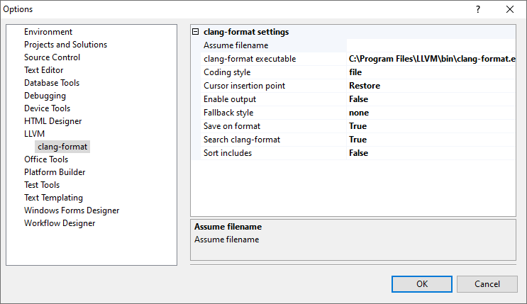
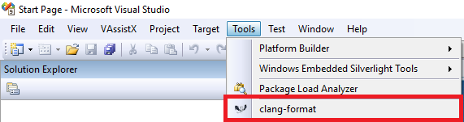

# clang-format for Visual Studio 2008 SP1

## Options



## Requirements
Visual Studio 2008 SP1 with Visual Studio SDK installed (SDK is required because it is not an official extension)

## Register extension
Copy
```
ClangFormat.dll
ClangFormat.pkgdef
```
to
```
C:\Users\<user>\AppData\Local\Microsoft\VisualStudio\9.0\Extensions\ClangFormat
```

To register the extension run
```
"C:\Program Files (x86)\Microsoft Visual Studio 2008 SDK\VisualStudioIntegration\Tools\Bin\regpkg" "C:\Users\<user>\AppData\Local\Microsoft\VisualStudio\9.0\Extensions\ClangFormat\ClangFormat.dll" /root:Software\Microsoft\VisualStudio\9.0 /codebase
```
The output should look like this
```
Registering   : ClangFormat 0.1.0.0
Registry Root : Software\Microsoft\VisualStudio\9.0
---------------------------------------------------
Installed Product:   ClangFormatPackage, Version 1.0
Package:          ClangFormatPackage {bb9ab141-fda4-4c6b-b243-ff097b1c2f54}
LoadKey:          LLVM ClangFormat
Version 1.0
Edition Required: Professional
Menu:             1000, 1
Package:          ClangFormatCSPackage {032e3e9a-ccca-33e6-bf9c-080012f8f08a}
Option Page:      LLVM\Clang Format

SUCCEEDED:        ClangFormat
```

To unregister the extension run
```
"C:\Program Files (x86)\Microsoft Visual Studio 2008 SDK\VisualStudioIntegration\Tools\Bin\regpkg" "C:\Users\<user>\AppData\Local\Microsoft\VisualStudio\9.0\Extensions\ClangFormat\ClangFormat.dll" /root:Software\Microsoft\VisualStudio\9.0 /unregister
```
The output should look like this
```
Unregistering : ClangFormat 0.1.0.0
Registry Root : Software\Microsoft\VisualStudio\9.0
---------------------------------------------------

SUCCEEDED:        ClangFormat
```
